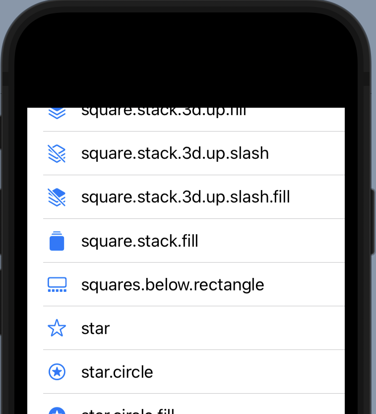
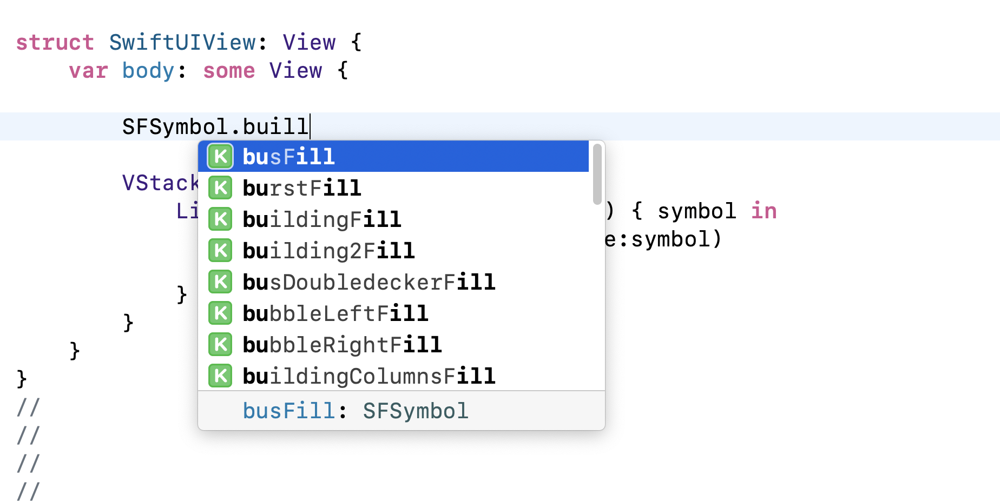
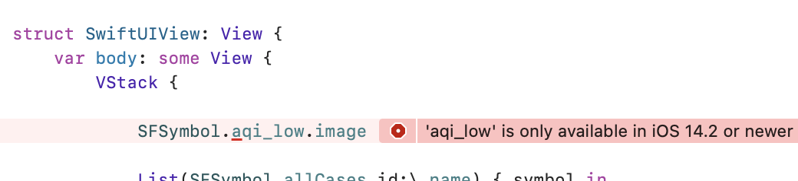

# SFSymbolEnum

A swift package to have SF Symbols available as enum instead of verbatim strings.

You can write now:

```swift
Image(systemImage:.person)
Label("Text",systemImage:.zlRectangleRoundedtopFill)
```

Or to see a list of all available symbols

```swift
struct SFSymbolsView: View {
  var body: some View {
    VStack {
      List(SFSymbol.allCases) { symbol in
        Label(symbol.name, sfsymbol: symbol)
      }
    }
  }
}
```



## Advantages

- Compiler error when you mistype a SFSymbol name
- Autocompletion and suggestion for all SFSymbols:



- Images are _available_ depending on os and version like this:



## Installation

### Xcode

- Add the package to your project: Xcode->Add Package Dependency add this url: https://github.com/FullQueueDeveloper/SFSymbolEnum
- Import in files like this:

```swift
import SFSymbolEnum
```

### XcodeGen

- Add the package to the top-level `packages` key

```yaml
packages:
  SFSymbolEnum:
    url: https://github.com/FullQueueDeveloper/SFSymbolEnum
    from: 3.0.1
```

- Add the package to your target's dependencies list:

```yaml
targets:
  App:
    type: application
    platform: iOS
    sources: [App]
    dependencies:
      - package: SFSymbolEnum
```

## Usage

Functions that are using the _systemImage_ argument can be used as before, but instead with the dot notation.
Symbol names translate to enums by replacing dots notation to camelcase and prefixing starting numbers with number.

Examples:

```swift
Image(systemName: "arrow.down.left.circle.fill")
Image(systemName: "0.circle")
Image(systemName: "arrow.2.circlepath.circle")
```

becomes:

```swift
Image(sfsymbol: .arrowDownLeftCircleFill)
Image(sfsymbol: .number0Circle)
Image(sfsymbol: .arrow2CirclepathCircle)
```

## How it's done

The code itself has been created with the `name_availablity.plist` inside the SF Symbols application.

### Generate enum

Swish script to generate the `enum`. Install [Swish](https://github.com/FullQueueDeveloper/Swish) from [HomeBrew](https://brew.sh), and run the `generate` script

```
brew tap fullqueuedeveloper/swish/swish
brew install swish
swish generate
```
